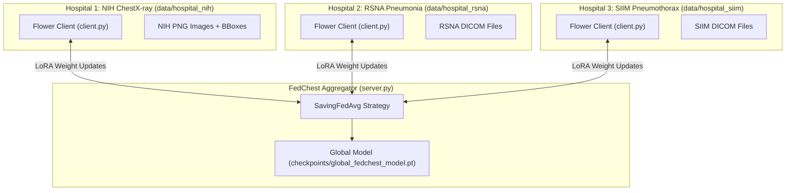

# FedChest AI: Multimodal Federated Learning for Chest Radiographs

[](https://www.python.org/downloads/)
[](https://pytorch.org/)
[](https://flower.dev/)
[](https://fastapi.tiangolo.com/)

**FedChest AI** is a privacy-preserving, federated learning framework and clinical decision-support portal for chest radiograph analysis. It enables multiple healthcare institutions (hospitals) to collaboratively train a high-accuracy multimodal diagnostic model on private patient datasets **without raw medical images or Protected Health Information (PHI) ever leaving local hospital firewalls**.

---

## 🌟 Key Features

- **Multi-Hospital Heterogeneous Dataset Support**: Seamlessly trains across distinct hospital nodes:
  - **Hospital 1 (NIH Node)**: 14 multi-label chest pathologies + bounding boxes (`PNG`).
  - **Hospital 2 (RSNA Node)**: Pneumonia detection with bounding box annotations (`DICOM .dcm`).
  - **Hospital 3 (SIIM Node)**: Pneumothorax segmentation masks converted to presence targets (`DICOM .dcm`).
- **Parameter-Efficient LoRA Fine-Tuning**: Injects Low-Rank Adaptation (LoRA) modules into DenseNet backbone layers ($<300\text{k}$ trainable parameters), minimizing network bandwidth during FL aggregation rounds.
- **HIPAA PHI Scrubbing**: Automatically detects and strips **18 DICOM PHI metadata tags** prior to processing.
- **Grad-CAM Explainability & Bounding Box Localization**: Generates real-time visual saliency heatmaps overlaid on radiographs alongside automated bounding box highlights.
- **Interactive Clinician Dashboard & Training Hub**: Dual-mode single-page application for scan analysis, clinical report generation, dataset sample uploads, and local hospital training execution.

---

## 🏗 System Architecture



---

## 📋 Prerequisites

Ensure your machine meets the following requirements:

- **Operating System**: Linux (Ubuntu 20.04+), macOS, or Windows 10/11
- **Python Version**: `Python 3.9` to `Python 3.12`
- **Hardware**: CPU supported; CUDA-compatible GPU recommended for accelerated training.
- **Git**: For cloning the repository.

---

## 🚀 Step-by-Step Setup Guide (Fresh PC Installation)

Follow these steps to set up and run FedChest AI on a new computer:

### Step 1: Clone the Repository
```bash
git clone https://github.com/your-username/FedchestAI.git
cd FedchestAI
```

### Step 2: Create & Activate a Virtual Environment

**On Linux / macOS:**
```bash
python3 -m venv venv
source venv/bin/activate
```

**On Windows (Command Prompt):**
```cmd
python -m venv venv
venv\Scripts\activate
```

### Step 3: Install Required Dependencies
```bash
pip install --upgrade pip
pip install -r requirements.txt
```

---

## 📁 Dataset Preparation & Partitioning

Before running model training, partition raw data into local hospital node directories:

```bash
python3 data_split.py
```

This generates 3 hospital dataset directories under `data/`:
- `data/hospital_nih/` (NIH multi-pathology node)
- `data/hospital_rsna/` (RSNA Pneumonia node)
- `data/hospital_siim/` (SIIM Pneumothorax node)

---

## 💻 Running Model Training

### Option A: Run Multi-Hospital Federated Learning (Recommended)
To run a 3-hospital Federated Learning simulation using Flower:

```bash
python3 train.py --mode fl
```

Or run the server and client processes in separate terminals:

```bash
# Terminal 1: Start Central FL Server
python3 server.py

# Terminal 2: Start Client 1 (Hospital NIH)
python3 client.py --node-dir data/hospital_nih

# Terminal 3: Start Client 2 (Hospital RSNA)
python3 client.py --node-dir data/hospital_rsna

# Terminal 4: Start Client 3 (Hospital SIIM)
python3 client.py --node-dir data/hospital_siim
```

### Option B: Run Local Single-Hospital Training
To train exclusively on a specific hospital dataset node:

```bash
python3 train.py --mode local --node-dir data/hospital_nih --epochs 5
```

---

## 🌐 Launching the Clinician Dashboard & Local Training Portal

Start the FastAPI application server:

```bash
python3 -m uvicorn app:app --host 0.0.0.0 --port 8000
```

Open your browser and navigate to:
👉 **`http://localhost:8000`**

### Available Interface Modes:
1. **Clinical AI Inference**: Upload a radiograph (`.dcm`, `.png`, `.jpg`) to view Grad-CAM heatmaps, anomaly bounding boxes, multi-pathology differential diagnosis, and an automated structured clinical report.
2. **Local Model Training Hub**: Add new scans + ground-truth pathology labels to hospital nodes, configure training hyper-parameters, and monitor live training progress & loss meters.

---

## 📂 Project Structure

```
FedchestAI/
├── app.py              # FastAPI server serving inference, PHI scrubbing, & training APIs
├── dashboard.html      # Glassmorphic single-page clinical portal & training hub
├── model.py            # Multimodal DenseNet backbone with LoRA residual adapters
├── dataset.py          # PyTorch dataset factory supporting NIH, RSNA DICOM, & SIIM DICOM
├── data_split.py       # Dataset partitioner initializing 3 hospital node datasets
├── client.py           # Flower FL client for local hospital training & evaluation
├── server.py           # Flower FL central server (SavingFedAvg aggregation strategy)
├── train.py            # Local and multi-hospital federated training orchestrator
├── report_engine.py    # Deterministic clinical radiology report generator
├── requirements.txt    # Python package dependencies
├── .gitignore          # Excludes raw dataset images, ZIP files, & pycache
└── checkpoints/        # Directory storing trained model weight checkpoints (.pt)
```

---

## 🛡 Privacy & HIPAA Security Compliance

- **De-identification**: Strips 18 DICOM metadata tags (*PatientName, PatientID, InstitutionName, StudyDate*, etc.) before image preprocessing.
- **On-Premises Data Retention**: Raw patient images remain strictly within local hospital storage. Only privacy-preserving LoRA gradient parameter updates are shared during FL.

---

## 📜 License

Distributed under the MIT License. See `LICENSE` for details.
